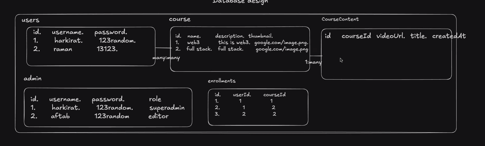
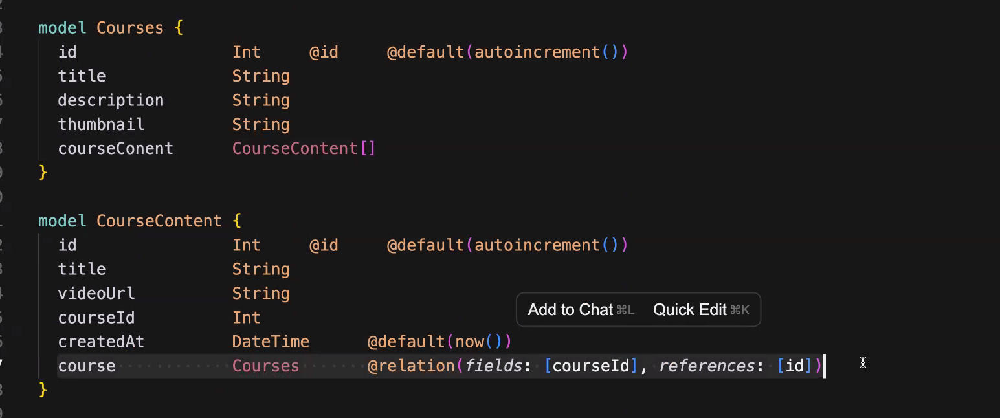
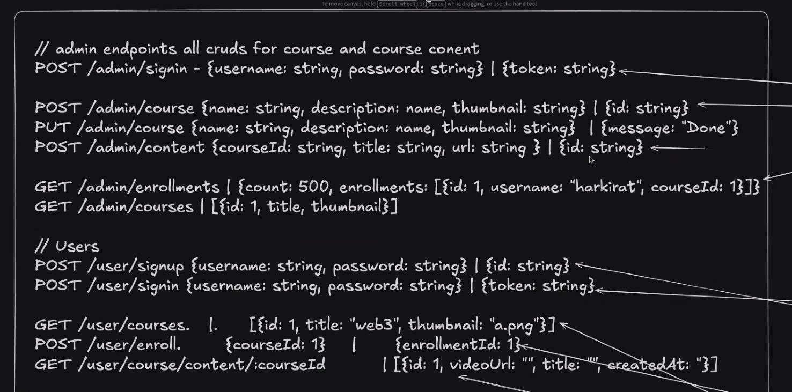
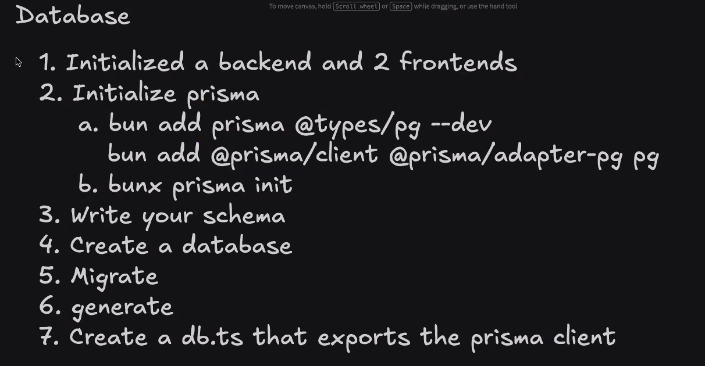

## **Functional requirements**
1. Admin can come and create a course
2. Admin can upload videos to the course
3. Users can come and enroll for a course
4. Users can watch the course videos
5. Support pdfs, assignments
6. Support payments
7. Make it b2b

## **DATABASE DESIGN**

This is how many to many relation(foreign key stuff works)

## **BACKEND (SCHEMA) ENDPOINTS**

## Steps

